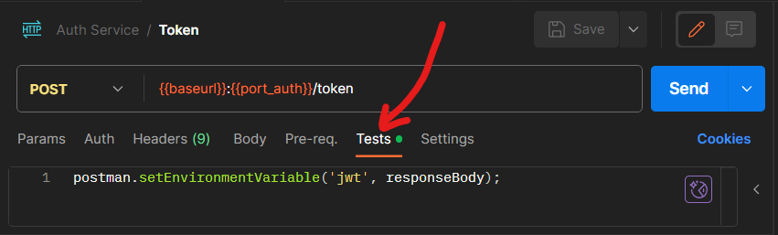
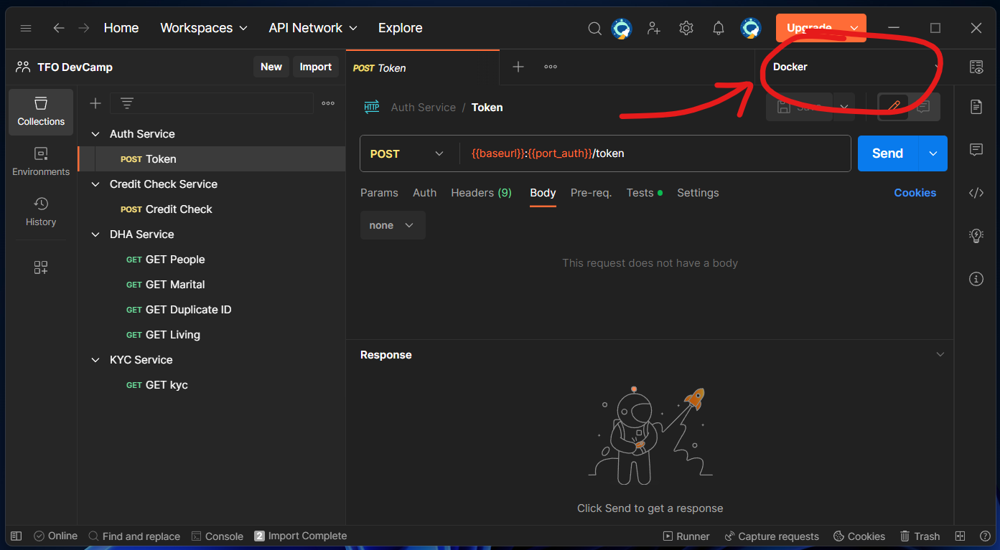

# DevCamp Services

## Table of contents

  - [Summary](#summary)
  - [Prerequisites](#prerequisites)
    - [Docker](#docker)
    - [Harbor credentials](#harbor-credentials)
    - [Postman](#postman)
  - [Repository](#repository)
  - [Running the services](#running-the-services)
  - [Interacting with the services](#interacting-with-the-services)
    - [Auth Service](#auth-service)
    - [KYC Service](#kyc-service)
    - [DHA Service](#dha-service)
    - [Credit Check Service](#credit-check-service)
    - [Customer Information Store Service](#customer-information-store-service)
    - [Postgres Database](#postgres-database)
  - [Postman Collections](#postman-collections)
  - [SoapUI](#soapui)

## Summary

There are five services available for consumption as part of the DevCamp practical exercise.

  - **Auth:** REST web service to obtain JWT tokens for auth with other services
  - **KYC:** REST web service to ontain KYC (Know Your Customer) information for customers
  - **DHA:** REST web service to obtain DHA (Dept. of Home Affairs) information for customers
  - **Credit Check:** SOAP web service to perform a credit check for customers
  - **Customer Information Store Service:** REST web service for maintaining customer information

## Prerequisites

In order to run these services so that you can interact with them, you will need the following:

### Docker

The services are made available as Docker images (see [Repository](#repository) section below) and these can be run with a single Docker compose file. In order to do that you will need a local installation of Docker or some alternative containerization platform. See the [Docker fo Windows](https://holocrons.entelect.co.za/code/local-development/docker-for-windows) holocron for information on alternatives to Docker Desktop.

### Harbor credentials

In order to access the Docker images on Harbor you will need to log in from the command line with the following command:

``` Bash
echo "YOUR_PASSWORD_HERE" | docker login harbor.entelectprojects.co.za --username "USER_NAME_HERE" --password-stdin
```

In order to pull the service images from Harbor, you will need credentials for Harbor. You can use the following Robot account that has only `read` access to these repo's:

username: robot-internaltraining-devcamp+robot-internaltraining-devcamp-readtoken
token: gmBwXzOuZrt7PehO5hB2b3xzagbt1faT

### Postman

It is not a requirement to have Postman installed but it would be beneficial as there are a few Postman collections availabe that could help you understand how to interact with the services. See the [Postman](#postman) section further down.

There is also a SoapUI project available for testing calls to the SOAP webservice, for those whose tooling preferences have been forged during the late cretacious period (see the [SoapUI](#soapui) section further down), but the same service and endpoint from that project is also available in the Postman collections.

## Repository

The services can be found as Docker images in the [internaltraining-devcamp](https://harbor.entelectprojects.co.za/harbor/projects/37/repositories) repository on Entelect's Harbor container registry.

For an introduction to Harbor, see the [Harbor Introduction](https://holocrons.entelect.co.za/build/container-registries/harbor-introduction/) holocron.

In order to access the Docker images on Harbor you will need to log in from the command line with the following command:

``` Bash
echo "YOUR_PASSWORD_HERE" | docker login harbor.entelectprojects.co.za --username "USER_NAME_HERE" --password-stdin
```

It is recommended that you acess these using the created robot account username (robot-internaltraining-devcamp+robot-internaltraining-devcamp-readtoken
) and token (gmBwXzOuZrt7PehO5hB2b3xzagbt1faT).

## Running the services

The services can be started in your local Docker host using the accompanying [Docker compose file](compose.yaml). Two of the services require configuration of a public key which is used internally for JWT auth. This public key is passed into the Docker composition as an environment variable, named `PUB_KEY`.

The public key is available as a [PEM-encoded public key file](app.pub).

You can set the environment variable and run docker compose all in one fell swoop with the following command:

Linux shell:
```bash
export PUB_KEY=$(cat app.pub) && docker-compose up
```

Powershell:
```PowerShell
$env:PUB_KEY = Get-Content app.pub; docker-compose up
```

## Interacting with the services

### Auth Service

The Auth service can be accessed at http://localhost:8080 and exposes a single endpoint:

- [POST] `/token`.

The service requires Basic Auth, making use of a username and password.

There should be 3 users that are currently configured in the DB. Their credentials are:

1. `admin@entelect.co.za` / `password`
2. `jesse.leresche@entelect.co.za` / `ILoveSpring`
3. `ahmad@entelect.co.za` / `SpringIsMeh`

The `admin@entelect.co.za` account can be used for your system-to-system communication.

The service responds to a successful request to the `/token` endpoint with a JWT in the response body. This JWT can be used for subsequent calls to the [KYC](#kyc-service), [DHA](#dha-service) and [CIS](#Customer Information Store Service)   .
# DevCamp Services

## Table of contents

- [Summary](#summary)
- [Prerequisites](#prerequisites)
    - [Docker](#docker)
    - [Harbor credentials](#harbor-credentials)
    - [Postman](#postman)
- [Repository](#repository)
- [Running the services](#running-the-services)
- [Interacting with the services](#interacting-with-the-services)
    - [Auth Service](#auth-service)
    - [KYC Service](#kyc-service)
    - [DHA Service](#dha-service)
    - [Credit Check Service](#credit-check-service)
    - [Customer Information Store Service](#customer-information-store-service)
    - [Postgres Database](#postgres-database)
- [Postman Collections](#postman-collections)
- [SoapUI](#soapui)

## Summary

There are five services available for consumption as part of the DevCamp practical exercise.

- **Auth:** REST web service to obtain JWT tokens for auth with other services
- **KYC:** REST web service to ontain KYC (Know Your Customer) information for customers
- **DHA:** REST web service to obtain DHA (Dept. of Home Affairs) information for customers
- **Credit Check:** SOAP web service to perform a credit check for customers
- **Customer Information Store Service:** REST web service for maintaining customer information

## Prerequisites

In order to run these services so that you can interact with them, you will need the following:

### Docker

The services are made available as Docker images (see [Repository](#repository) section below) and these can be run with a single Docker compose file. In order to do that you will need a local installation of Docker or some alternative containerization platform. See the [Docker fo Windows](https://holocrons.entelect.co.za/code/local-development/docker-for-windows) holocron for information on alternatives to Docker Desktop.

### Harbor credentials

In order to pull the service images from Harbor, you will need credentials for Harbor. These will be distributed separate to this document.

### Postman

It is not a requirement to have Postman installed but it would be beneficial as there are a few Postman collections availabe that could help you understand how to interact with the services. See the [Postman](#postman) section further down.

There is also a SoapUI project available for testing calls to the SOAP webservice, for those whose tooling preferences have been forged during the late cretacious period (see the [SoapUI](#soapui) section further down), but the same service and endpoint from that project is also available in the Postman collections.

## Repository

The services can be found as Docker images in the [internaltraining-devcamp](https://harbor.entelectprojects.co.za/harbor/projects/37/repositories) repository on Entelect's Harbor container registry.

For an introduction to Harbor, see the [Harbor Introduction](https://holocrons.entelect.co.za/build/container-registries/harbor-introduction/) holocron.

In order to access the Docker images on Harbor you will need to log in from the command line with the following command:

``` Bash
echo "YOUR_PASSWORD_HERE" | docker login harbor.entelectprojects.co.za --username "USER_NAME_HERE" --password-stdin
```

It is recommended that you acess these using the created robot account username (robot-internaltraining-devcamp+robot-internaltraining-devcamp-readtoken
) and token (gmBwXzOuZrt7PehO5hB2b3xzagbt1faT).

## Running the services

The services can be started in your local Docker host using the accompanying [Docker compose file](compose.yaml). Two of the services require configuration of a public key which is used internally for JWT auth. This public key is passed into the Docker composition as an environment variable, named `PUB_KEY`.

The public key is available as a [PEM-encoded public key file](app.pub).

You can set the environment variable and run docker compose all in one fell swoop with the following command:

Linux shell:
```bash
export PUB_KEY=$(cat app.pub) && docker-compose up
```

Powershell:
```PowerShell
$env:PUB_KEY = Get-Content app.pub; docker-compose up
```

## Interacting with the services

### Auth Service

The Auth service can be accessed at http://localhost:8080 and exposes a single endpoint:

- [POST] `/token`.

The service requires Basic Auth, making use of a username and password.

There should be 3 users that are currently configured in the DB. Their credentials are:

1. `admin@entelect.co.za` / `password`
2. `jesse.leresche@entelect.co.za` / `ILoveSpring`
3. `ahmad@entelect.co.za` / `SpringIsMeh`

The `admin@entelect.co.za` account can be used for your system-to-system communication.

The service responds to a successful request to the `/token` endpoint with a JWT in the response body. This JWT can be used for subsequent calls to the [KYC](#kyc-service), [DHA](#dha-service) and [CIS](#Customer Information Store Service)   .

The
The returned JWT is valid only for an hour, after which time a new JWT will have to be obtained from the Auth service.

### KYC Service

The KYC service can be accessed at http://localhost:8081 and exposes a single endpoint:

- [GET] `/kyc/{customerId}`

The service requires a Bearer token in the Authorization header. The bearer token must be a JWT obtained from the Auth service.

The service is documented in the accompanying [OpenAPI document](kyc.yaml) or at http://localhost:8081/swagger/index.html when the service is running.

### DHA Service

The DHA service can be accessed at http://localhost:8082 and exposes four endpoints:

- [GET] `/status/people`
- [GET] `/status/marital/{idNumber}`
- [GET] `/status/duplicateId/{idNumber}`
- [GET] `/status/living/{idNumber}`

The service requires a Bearer token in the Authorization header. The bearer token must be a JWT obtained from the Auth service.

The service is documented in the accompanying [OpenAPI document](dha.yaml) or at http://localhost:8082/swagger/index.html when the service is running.

### Credit Check Service 

The Credit Check service can be accessed at http://localhost:8083 and exposes a single endpoint:

- `/CreditCheck`

The service requires Basic Auth, making use of a username and password.

The service is documented in the accompanying [WSDL document](creditcheck.wsdl)

### Customer Information Store Service

The customer information store can be accessed on http://localhost:8084 and exposes 12 endpoints for maintaining customer information:

- [GET] `/v1/customers`
- [GET] `/v1/customer/{customer_id}`
- [POST] `/v1/customer/`
- [GET] `/v1/customer/`
- [GET] `/v1/customerTypes`
- [POST] `/v1/customerTypes`
- [PUT] `/v1/customer/{customerId}/customerTypes/{customerTypeId}`
- [GET] `/v1/customer/{customerId}/documents`
- [POST] `/v1/customer/{customerId}/documents`
- [GET] `/v1/accountTypes`
- [POST] `/v1/accountTypes`
- [POST] `/v1/customer/{customerId}/accounts/{accountTypeId}`

This service requires a Bearer Token in JWT format to be able to be accessed.

The service is documented in the accompanying [OpenAPI document](customer-information.yaml)

### Postgres Database

There is a postgres database that has been deployed along with the services. You can use this service to store informtation for the services that you have built (should you want to).

If you are running your services on the docker environment, you can use the docker container name as the hostname for the database:

spring:
    datasource:
    url: jdbc:postgresql://DevCamp-Postgres-db:5432/postgres
    username: user
    password: password
    driverClassName: org.postgresql.Driver

If you add the container to the docker compose file, it will be able to access the network by defaul. If you want to run the docker image seperately, you will need to specify the network that the docker container should use. If we remove the decvamp-cis-service from our docker compose file and would run it with just docker, the command would be as follows:

```bash
docker run --network devcamp-starter_default -p 8084:8080 harbor.entelectprojects.co.za/internaltraining-devcamp/devcamp-cis-service:latest
```

If you are running your application "locally" (i.e. intellij, mvnw or java run) then you would need to specify the db hostname as localhost. I would recommend using spring profiles and having one for running the service locally and another for using the service via a docker container. 

## Postman Collections

In the [/Postman](Postman/) folder of this repository, there are five collections that can be imported into your Postman workspace:

- [Auth Service.postman_collection.json](Postman/Auth%20Service.postman_collection.json)
- [KYC Service.postman_collection.json](Postman/KYC%20Service.postman_collection.json)
- [DHA Service.postman_collection.json](Postman/DHA%20Service.postman_collection.json)
- [Credit Check Service.postman_collection.json](Postman/Credit%20Check%20Service.postman_collection.json)
- [Customer Information Store.postman_collection.json](Postman/)

Additionally there is also an environment that can be imported into your workspace:

- [Docker.postman_environment.json](Docker.postman_environment.json)

These collections and environment will enable you to test all four of the services if they are running through Docker Compose.

It is worth pointing out that the `POST Token` request in the `Auth Service` collection includes a Test Script which automatically writes the returned JWT into the `{{jwt}}` variable of the active environment. This means that you do not have to manually copy and paste the JWT in order to test the KYC Service and DHA Service.



Finally, it is also important to note that the Postman environment imported above needs to be selected as the active environment in the top right corner of Postman in order for the variables defined in it to take effect.



## SoapUI

In the [/SoapUI](SoapUI/) folder of this repository, there is a [SoapUI project file](SoapUI/creditcheck-soapui-project.xml) which includes some test SOAP Api calls to the Credit Check Service.